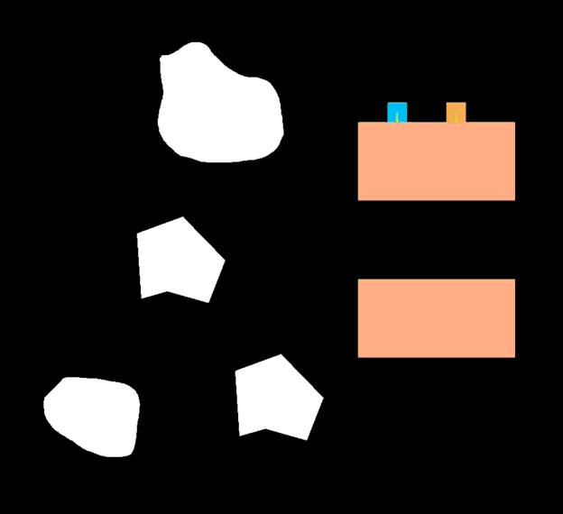

# Lap 2 Check-in:

I'm running a little behind on where I wanted the game to be at this point, but I did make
some progress. I mostly spent time finishing a directional gravity example I had started
a long time ago. Now that I have that example finished, I will adapt it into what
I need it to be for my Slow Jam 03 game.

I also came up with a name for my game. The name of my game will be Vestige.

That is all I have for now, I was hoping/thinking I would have more time to work
on it this weekend, but I got a little busy.

Here is the directional gravity example I worked on in action:

