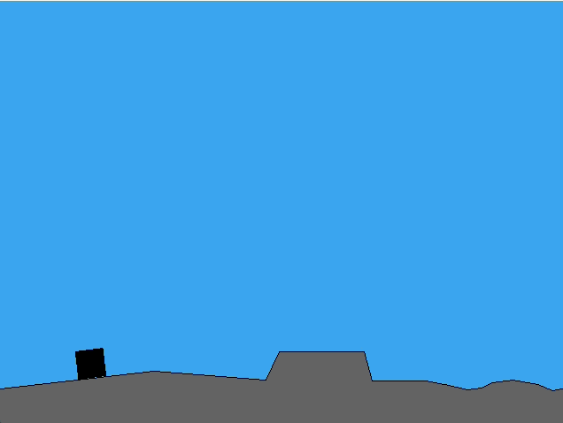
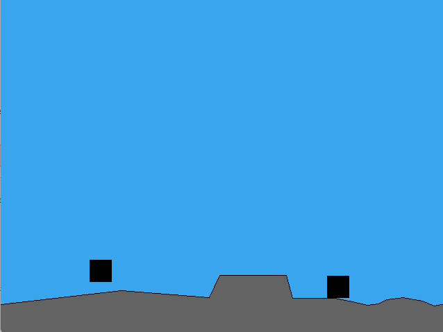
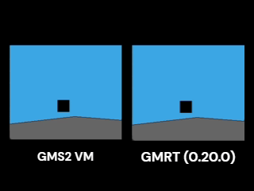

# Lap 3 Check-in:

I spent this month adapting the directional gravity example I made into what I want it to be for Vestige.
This ended up taking a lot more time and effort than I thought it would. Here was my first test after copying
and pasting from the directional gravity stuff and doing some minimal changes:

😬

After a lot more time and effort I eventually got to this point:

There are still a lot of minor things that I would like to do that I think
would really improve the feel of the platforming, but we are already over
halfway through Slow Jam 03, and I think I need to move on from this part
if I want to finish my game on time. If I end up having time later, I will
come back and improve these things.

I've been developing this and testing it using the GMS2 VM windows export,
but once I had it working I decided I should try it on GMRT to keep with my
goal of having it run on GMRT in the end. Here is a side by side comparing
the same inputs in GMS2 VM and GMRT (0.20.0):

It is probably hard to see because of the quality of the gif, but GMRT tends
to snap the player down to the ground too early while GMS2 does not. What probably
is more noticable is that the player ends up at a different location when using
GMRT 😢.

I haven't had time to dig in and figure out why/where GMRT causes the player to
behave differently, but I suspect it has to do with the ground detection finding
ground too early. Hopefully I'll have time in the future to really look at this
and see what is going on.

That is my Lap 3 check-in. I think I am quite behind where I need to be, hopefully
I'll be able to finish in time. The next step I think will be designing
the layout of the world and locations. As I create the different rooms in the world,
I will develop the different systems that I need as I go along